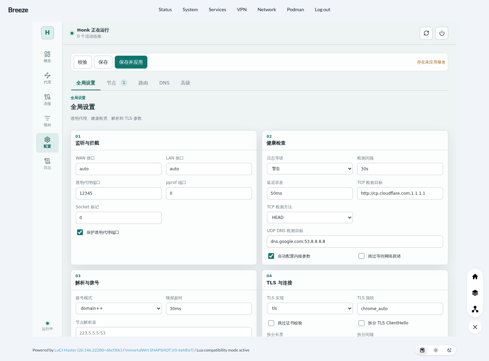
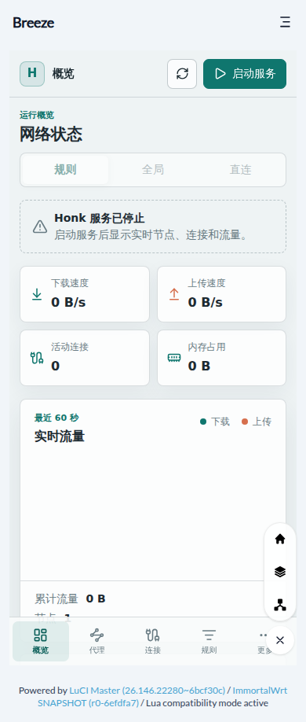

# Honk OpenWrt Feed

English | [简体中文](README.zh-CN.md)

This repository packages [Honk](https://github.com/Glassyiris/honk), a Rust/eBPF transparent proxy engine, for OpenWrt together with a native LuCI management interface.

The feed contains three packages:

- honk: honk-core, honk-tool, the procd service, default configuration, eBPF assets, and runtime logging.
- luci-app-honk: the new standalone LuCI controller, mode/DNS generator, node and device workflow, diagnostics, and dashboard.
- luci-app-honk-legacy: the preserved legacy LuCI dashboard for rollback and migration reference. It uses its own controller, ACL, menu, API, and static namespace.

Builds use the exact upstream commit recorded in `locks/source.lock.json`. The package currently targets OpenWrt x86_64 and aarch64. A scheduled workflow checks Honk `main` daily and opens an update PR for revisions that pass source, checksum, and patch validation.

## Screenshots

The dashboard is a single native LuCI page. It does not download or embed a second external dashboard.

| Overview | Configuration |
| --- | --- |
|  |  |

The layout also adapts to narrow screens:

## Features

- Rust/eBPF transparent proxy runtime managed by OpenWrt procd.
- Ordered routing rules with direct, proxy, block, group, and direct(must) actions.
- Rule, Global, and Direct runtime modes through the Clash-compatible API.
- Node import, editing, removal, connection testing, subscriptions, and selector groups.
- DNS upstream editing for UDP, TCP, TCP+UDP, TLS, HTTPS, H3, and QUIC.
- Separate DNS request and response routing configuration.
- Live traffic, connection, memory, node, rule, and service status views.
- Honk logs stored in /tmp/honk/honk.log instead of being forwarded to logread.
- Atomic save/apply flow with validation, revision checks, and restart rollback.

## Package Layout

~~~text
honk/                  OpenWrt recipe for the Honk engine and service
luci-app-honk/         New standalone LuCI package and dashboard source
luci-app-honk-legacy/  Preserved legacy LuCI package and dashboard source
honk/patches/          OpenWrt-specific upstream patches
locks/source.lock.json Source and patch digest lock file
tests/                 Focused packaging and integration checks
~~~

## Requirements

The fast package path supports x86_64 and aarch64 targets. It needs an OpenWrt SDK plus feeds that provide kmod-sched-core, kmod-sched-bpf, kmod-veth, and the usual base runtime libraries. GeoSite and GeoIP are provisioned from the exact offline inputs in `locks/geo.lock.json`; the Honk package has no runtime dependency on a target package manager's `v2ray-*` Geo data. Rust is not installed in the SDK container on this path.

The separate binary build runs on a standard Linux host with Rust stable, Rust nightly with rust-src, bpf-linker, LLVM/libclang, CMake, and Zig 0.14.1. It produces static musl binaries with the BTF-enabled eBPF object embedded. When no binaries are staged under `honk/files/bin/`, the package recipe retains its source-build fallback and requires the original Rust OpenWrt toolchain.

## Build

Download and verify the matching static binary release before running the fast package build. GitHub Actions performs this step automatically; locally, run one of:

~~~sh
PACKAGE_ARCH=x86_64 .github/scripts/download-honk-binaries.sh
PACKAGE_ARCH=aarch64 .github/scripts/download-honk-binaries.sh
~~~

Then install this checkout as an OpenWrt feed or place the package directories in the buildroot, refresh feeds, and select both packages:

~~~sh
./scripts/feeds update honk
./scripts/feeds install -a -p honk
make menuconfig
make package/honk/compile V=s
make package/luci-app-honk/compile V=s
make package/luci-app-honk-legacy/compile V=s
~~~

For the dashboard source alone:

~~~sh
cd luci-app-honk/ui
npm ci
npm run build
~~~

The generated LuCI assets are committed below luci-app-honk/root/www/luci-static/resources/honk/app/.

### GitHub Actions

`Update Honk upstream` checks upstream `main` every day. When a new revision is available, it downloads the commit archive, calculates its SHA-256 and Git tree, validates every local patch, and creates or updates the `automation/honk-upstream` PR. It can also be run manually from the Actions page. Patch conflicts stop the refresh and retain the current buildable revision.

The `Build Honk binaries` workflow compiles Honk directly on standard Linux runners. Its two parallel jobs use Zig to cross-compile static musl binaries for x86_64 and aarch64; no OpenWrt SDK is involved. Each architecture archive contains `honk-core`, `honk-tool`, a manifest, and checksums.

After a binary release succeeds, `Build packages` downloads and verifies the matching archive, then starts the OpenWrt SDK matrix. LuCI-only changes reuse the existing binary release. The matrix builds:

- IPK packages for OpenWrt 24.10 on x86_64 and aarch64_generic.
- APK packages for OpenWrt 25.12 on x86_64 and aarch64_generic.

Each matrix job only packages the staged binaries, service files, and LuCI assets; it does not compile Rust or eBPF. It uploads `honk`, `luci-app-honk`, and `luci-app-honk-legacy` as workflow artifacts. After all four builds pass, the workflow publishes the same files in a versioned GitHub Release. The architecture and SDK are appended to release filenames so LuCI's architecture-independent packages are still easy to identify.

## Install

Build or download the engine and the LuCI packages, install honk first, then choose the new package. Keep the legacy package only when rollback/reference access is needed; the two LuCI packages have disjoint paths:

~~~sh
# apk-based OpenWrt snapshots
apk add ./honk-*.apk ./luci-app-honk-*.apk

# opkg-based images
opkg install honk-*.ipk luci-app-honk-*.ipk
~~~

The LuCI page is available at:

~~~text
/cgi-bin/luci/admin/services/honk
~~~

The new page is available at `/cgi-bin/luci/admin/services/honk`; the preserved package is isolated at `/cgi-bin/luci/admin/services/honk-legacy/`. The new controller reads and preserves existing node, subscription, experimental, and unknown sections while rebuilding only its managed mode sections. Each apply validates, backs up, atomically writes, restarts Honk, checks health, and restores the previous configuration on failure.

## Quick Setup and Geo Assets

Quick Setup is the first Honk view. It uses the existing subscription and node data and writes only the single `/etc/honk/config.dae` runtime configuration. The four presets are GFWList, China Direct, Global Proxy, and Direct. Each preview shows the selected source groups, discovered LAN/WAN devices, route/DNS projection, revision, and a server-generated candidate digest before an apply is accepted. The Advanced editor remains available; an advanced-owned configuration requires an explicit replacement confirmation.

The package ships the locked assets under Honk-owned paths:

| Asset | Locked input | Installed payload | Public loading path |
| --- | --- | --- | --- |
| GeoSite | Loyalsoldier release `202607312254`, SHA-256 `1f3a743e8e30152a870a1674792af3976361436dcb1f510a43c499d430f6b13f` | `/usr/lib/honk/geosite.dat` | `/usr/share/honk/geosite.dat` |
| GeoIP | V2Fly release `202607171233`, SHA-256 `b71d1999439dde2de2d2b6844a2befa50c50211ff739785c005ca7c230a17d6a` | `/usr/lib/honk/geoip.dat` | `/usr/share/honk/geoip.dat` |

`/usr/share/honk/geo.lock.json` and `/run/honk/geo-assets.json` record provenance and the active receipt. A V2Fly or custom GeoSite path, a missing label, or a hash mismatch disables only presets that need the locked GeoSite. The confirmation-based Geo repair command recreates the Honk-owned symlink after verifying the packaged payload; it does not touch `/usr/share/v2ray` or download rules. A service restart is still required before the live receipt re-opens those presets.

Quick mutations are handled by `/usr/libexec/honk/quick-transaction-worker`. It keeps the previous bytes in a root-only sidecar, records each durable stage, and restores the prior running or stopped state after a failed restart, subscription wait, or probe. A failed recovery is reported as `degraded` and remains visible for operator action. Direct can be applied without a proxy subscription, while proxy presets require a non-empty, validated source group and the Geo/DNS/interface gates. Geo data is updated by changing the lock and package inputs, not through an online LuCI action.

## Runtime Paths

| Purpose | Path |
| --- | --- |
| Main configuration | /etc/honk/config.dae |
| Default template | /etc/honk/config.dae.default |
| Optional includes | /etc/honk/config.d/ |
| UCI service settings | /etc/config/honk |
| Init script | /etc/init.d/honk |
| Runtime log | /tmp/honk/honk.log |
| LuCI assets | /www/luci-static/resources/honk/app/ |

Validate and start from a shell:

~~~sh
honk-tool validate --config /etc/honk/config.dae --json
/etc/init.d/honk enable
/etc/init.d/honk start
~~~

`config.dae.default` is the complete package-provided Honk baseline and is not a conffile. The user-owned
`config.dae` is preserved across upgrades. If the active configuration is missing, the init script seeds it from
the template before running the normal `honk-tool validate` and Geo preflight. The LuCI Advanced page uses the same
template for its Restore defaults action, saves the current valid configuration as
`/etc/honk/config.dae.last-good`, and rolls back if replacement or reload fails.

The launcher writes Honk stdout and stderr to the runtime log. The init script does not configure procd stdout/stderr forwarding, so core output stays out of the system log.

## Routing

Honk evaluates routing rules from top to bottom. The first matching rule wins; fallback handles everything else. A typical split configuration is:

~~~dae
routing {
    dip(10.0.0.0/8, 172.16.0.0/12,
        192.168.0.0/16, 127.0.0.0/8) -> direct(must)
    dip(geoip: private) -> direct
    dip(geoip: cn) -> direct
    domain(geosite: cn) -> direct
    fallback: proxy
}
~~~

The proxy target can be a node or a group. A selector group can be populated from a subscription:

~~~dae
subscription {
    remote {
        url: 'https://example.invalid/subscribe'
        enabled: true
    }
}

group {
    proxy {
        filter: subscription('remote')
        policy: selector
        final: direct
    }
}
~~~

Rule mode follows the routing table. Global sends non-direct traffic to the selected primary node, while Direct sends non-must traffic directly. direct(must) and block decisions remain final across mode changes.

## DNS

DNS has its own upstream and request/response routing sections:

~~~dae
dns {
    upstream {
        local: 'udp://223.5.5.5:53'
        remote: 'https://dns.google/dns-query' -> proxy
    }
    routing {
        request {
            qname(geosite: cn) -> local
            fallback: remote
        }
        response {
            fallback: accept
        }
    }
}
~~~

Supported upstream prefixes are udp://, tcp://, tcp+udp://, tls://, https://, h3://, and quic://. The LuCI editor exposes the protocol, host, port, path, SNI, and outbound fields as form controls.

## Logs and Recovery

Inspect the bounded runtime log when a service action or node fails:

~~~sh
tail -n 200 /tmp/honk/honk.log
honk-tool validate --config /etc/honk/config.dae --json
~~~

If an applied configuration prevents startup, restore the last-good copy when present:

~~~sh
cp /etc/honk/config.dae.last-good /etc/honk/config.dae
honk-tool validate --config /etc/honk/config.dae --json
/etc/init.d/honk restart
~~~

Honk owns its TC, namespace, route, and eBPF lifecycle. Quick Setup does not create a second route model or configuration writer.

## Development Checks

~~~sh
bash tests/run-tests.sh
git diff --check
cd luci-app-honk/ui && npm ci && npm run build
~~~

The package checks verify source and patch digests, locked Geo payloads, shell/Lua syntax, RPC/menu manifests, generated assets, and the Quick Setup/transaction contracts used by the LuCI bridge.

## Upstream Documentation

- [Honk configuration guide](https://github.com/Glassyiris/honk/blob/main/doc/configuration.en.md)
- [Honk components guide](https://github.com/Glassyiris/honk/blob/main/doc/components.en.md)
- [Honk upstream repository](https://github.com/Glassyiris/honk)
